 

  

  
  
  

 

 

## Open Source

23 substantive merged PRs across **Apple, OpenAI, Meta, Microsoft, NVIDIA, Google, Cloudflare, Jest, Hono,** and **MLX**.

### Flagship landings

| PR | What it fixes |
|---|---|
| [facebook/pyrefly#3415](https://github.com/facebook/pyrefly/pull/3415) | Fixed negative narrowing for `isinstance` tuple targets in Meta's Python type checker (landed via Phabricator) |
| [apple/container#1559](https://github.com/apple/container/pull/1559) | Reject conflicting DNS flags in the `apple/container` CLI |
| [apple/coremltools#2700](https://github.com/apple/coremltools/pull/2700) | K-Means weight-palettization correctness — intra-cluster error instead of centroid-coordinate sums |
| [apple/password-manager-resources#1094](https://github.com/apple/password-manager-resources/pull/1094) | Node.js CI validation for all 419 password-rule entries; catches malformed rules before browsers see them |
| [microsoft/rushstack#5805](https://github.com/microsoft/rushstack/pull/5805) | `package-deps-hash` handles Windows reserved names (`CON`, `PRN`, `NUL`) on Linux/macOS branches |
| [microsoft/rushstack#5804](https://github.com/microsoft/rushstack/pull/5804) | Rush lockfile-change warnings route to stderr so piping stdout doesn't break |
| [honojs/hono#4951](https://github.com/honojs/hono/pull/4951) | `compress` middleware respects `Accept-Encoding` exclusions; +8 tests across zero-q, wildcard, multi-q-value, override cases |
| [jestjs/jest#16196](https://github.com/jestjs/jest/pull/16196) | Widened `toMatchObject` / `objectContaining` TS matcher signatures for class instances (longstanding TS2345) |
| [NVIDIA/apex#2003](https://github.com/NVIDIA/apex/pull/2003) | Replaced `type(x) == cls` with `isinstance` across fused optimizer, GPU Direct Storage, and OpenFold Triton paths |
| [openai/openai-agents-python#3485](https://github.com/openai/openai-agents-python/pull/3485) | Redacts raw failed JSON tool input from `ModelBehaviorError` when tool-data logging is disabled |

Plus targeted fixes in **apple/swift-nio, apple/servicetalk, apple/containerization, apple/foundationdb, ml-explore/mlx, NVIDIA/gpu-operator, NVIDIA/TransformerEngine, NVIDIA/earth2studio, google/go-cloud, facebook/lexical, cloudflare/workers-sdk**.

## Projects

- **[ShadowBuyer](https://github.com/LeSingh1/shadowbuyer)** — Autonomous B2B procurement agent swarm. Six agents (vendor scouting, quote collection, adversarial negotiation, contract redline, email drafting). Python · FastAPI · React · Vite · Zeabur. Live demo cut pricing $195 → $157.50 per host/month (≈$225K annual savings at 500 hosts). **Won $500 at Beta Fund AI Super Hackathon.**
- **[urbanmind-vision](https://github.com/LeSingh1/urbanmind-vision)** — Full-stack 50-year city-planning simulator. PPO RL agent (Stable Baselines3), constraint-validated road generator, WebSocket-streamed frames, Claude AI Copilot. React + FastAPI + Mapbox.
- **[shotsense-scout](https://github.com/LeSingh1/shotsense-scout)** — NBA playoff shot-quality agent. MongoDB Atlas Vector Search + Google Cloud Agent Builder + Gemini.
- **[nba_shot_quality](https://github.com/LeSingh1/nba_shot_quality)** — Calibrated NBA xFG% model on `nba_api`. GroupKFold, in-pipeline `TargetEncoder`, empirical-Bayes shrinkage, LogReg baseline. Canvas shot maps + Three.js arc replays.
- **[edgeboard](https://github.com/LeSingh1/edgeboard)** — Real-time PrizePicks board + lineup optimizer. Live MLB Stats API + ESPN data, correlation-aware Smart Suggest.

## Robotics & Leadership

- **Lead CAD Designer & CAD Team Captain** — FTC Robotics. Fusion 360: chassis, mechanisms, full robot layout, technical blueprints. **3× FTC Qualifier Finalist.**
- **Senior Patrol Leader** — Boy Scouts. Leads a troop of 40–50 scouts.
- **Freshman Team Captain** — Irvington HS Basketball. Leads the team in scoring, rebounding, and blocks.

## Professional Development

- **Anthropic Academy** (Completed May 2026) — AI fluency, Claude fundamentals, Claude Code, agent skills, subagents
- *In progress:* Claude API, Claude on Amazon Bedrock, Claude on Google Cloud Vertex AI, Model Context Protocol

 

### GitHub Activity

 

  

### Stack

**`Languages`**
 

**`Frameworks`**
 

**`Infra & Tools`**
 

 

