 

## Career Highlights

- **Beta Fund AI Super Hackathon** · winner · $500 · built [ShadowBuyer](https://github.com/LeSingh1/shadowbuyer)
- **ShadowBuyer demo** · saved a roleplayed F500 buyer $225k in one run
- **[facebook/pyrefly#3415](https://github.com/facebook/pyrefly/pull/3415)** · landed via Phabricator · flagship merge
- **23 PRs merged** across Meta, Apple, Microsoft, NVIDIA, Cloudflare, Google, OpenAI, Astral, and friends
- **50+ PRs in review** · 10 orgs reached

## Flagship Open Source Landings

| PR | What it fixes |
|---|---|
| [facebook/pyrefly#3415](https://github.com/facebook/pyrefly/pull/3415) | Fixed negative narrowing for `isinstance` tuple targets in Meta's Python type checker. Landed on main via Phabricator. |
| [apple/container#1559](https://github.com/apple/container/pull/1559) | Reject conflicting DNS flags in the `apple/container` CLI. |
| [apple/coremltools#2700](https://github.com/apple/coremltools/pull/2700) | K-Means weight-palettization correctness. Intra-cluster error instead of centroid-coordinate sums. |
| [apple/password-manager-resources#1094](https://github.com/apple/password-manager-resources/pull/1094) | Node.js CI validation for all 419 password-rule entries; catches malformed rules before browsers see them. |
| [microsoft/rushstack#5805](https://github.com/microsoft/rushstack/pull/5805) | `package-deps-hash` handles Windows reserved names (`CON`, `PRN`, `NUL`) on Linux/macOS branches. |
| [microsoft/rushstack#5804](https://github.com/microsoft/rushstack/pull/5804) | Rush lockfile-change warnings route to stderr so piping stdout doesn't break. |
| [honojs/hono#4951](https://github.com/honojs/hono/pull/4951) | `compress` middleware respects `Accept-Encoding` exclusions. +8 tests across zero-q, wildcard, multi-q-value, override cases. |
| [jestjs/jest#16196](https://github.com/jestjs/jest/pull/16196) | Widened `toMatchObject` / `objectContaining` TS matcher signatures for class instances. |
| [NVIDIA/apex#2003](https://github.com/NVIDIA/apex/pull/2003) | Replaced `type(x) == cls` with `isinstance` across fused optimizer, GPU Direct Storage, and OpenFold Triton paths. |
| [openai/openai-agents-python#3485](https://github.com/openai/openai-agents-python/pull/3485) | Redacts raw failed JSON tool input from `ModelBehaviorError` when tool-data logging is disabled. |

Plus targeted fixes in **apple/swift-nio, apple/servicetalk, apple/containerization, apple/foundationdb, ml-explore/mlx, NVIDIA/gpu-operator, NVIDIA/TransformerEngine, NVIDIA/earth2studio, google/go-cloud, facebook/lexical, cloudflare/workers-sdk**.

## Currently Shipping

- **[ShadowBuyer](https://github.com/LeSingh1/shadowbuyer)** — Autonomous B2B procurement agent swarm. Six agents (vendor scouting, quote collection, adversarial negotiation, contract redline, email drafting). Python, FastAPI, React, Vite, Zeabur. Live demo cut pricing $195 → $157.50 per host/month (about $225K annual savings at 500 hosts). Won $500 at Beta Fund AI Super Hackathon.
- **[urbanmind-vision](https://github.com/LeSingh1/urbanmind-vision)** — Full-stack 50-year city-planning simulator. PPO RL agent (Stable Baselines3), constraint-validated road generator, WebSocket-streamed frames, Claude AI Copilot. React + FastAPI + Mapbox.
- **[shotsense-scout](https://github.com/LeSingh1/shotsense-scout)** — NBA playoff shot-quality agent. MongoDB Atlas Vector Search + Google Cloud Agent Builder + Gemini.
- **[nba_shot_quality](https://github.com/LeSingh1/nba_shot_quality)** — Calibrated NBA xFG% model on `nba_api`. GroupKFold, in-pipeline `TargetEncoder`, empirical-Bayes shrinkage, LogReg baseline. Canvas shot maps + Three.js arc replays.
- **[edgeboard](https://github.com/LeSingh1/edgeboard)** — Real-time PrizePicks board + lineup optimizer. Live MLB Stats API + ESPN data, correlation-aware Smart Suggest.

## Off the Court

- **Senior Patrol Leader** · Boy Scouts of America · troop of 40 to 50
- **Freshman team basketball captain** · Irvington HS
- **Lead CAD Designer & CAD Team Captain** · FTC Robotics · 3× regional finalist
- **2 Eagle Scout service projects led**
- **Anthropic Academy** (completed May 2026) · agentic systems track

## Reach

- github.com/LeSingh1
- linkedin.com/in/shaurya-singh-b7591540b
- sshaurya914 [at] gmail
