 

 

<!-- ============ CAREER HIGHLIGHTS ============ -->

<table>
<tr>
<td width="50%" valign="top">

#### Beta Fund × EverMind Hackathon
First place, Audience Favorite. $600. Built [SwarmMarket](https://github.com/LeSingh1/swarm-market) — an app store for agent experience, where agents publish and install skill-packs over MCP.

#### Beta Fund AI Super Hackathon
First place. $500. Built [ShadowBuyer](https://github.com/LeSingh1/shadowbuyer). Saved a roleplayed Fortune 500 buyer $225K in a single negotiation.

</td>
<td width="50%" valign="top">

#### Flagship merge: meta/pyrefly
[#3415](https://github.com/facebook/pyrefly/pull/3415) landed on `main` via Phabricator. Meta's Python type checker.

#### Reach
30 merges across Meta, Apple, Microsoft, NVIDIA, Cloudflare, Google, OpenAI, Vue, Jest, Hono, ml-explore. Walked in cold.

</td>
</tr>
</table>

 

<!-- ============ FEATURED BUILDS ============ -->

<table>
<tr>
<td width="50%" valign="top">

#### EdgeBoard
A real-time PrizePicks board and lineup optimizer. It pulls the live board, projects each player's stat from their recent game log, calibrates the probability, and scores slips on the real payout tiers. 13 sports, models retrain themselves every day. Next.js and TypeScript. [Repo](https://github.com/LeSingh1/edgeboard).

</td>
<td width="50%" valign="top">

#### edge-models
Player prop projection models for 13 sports, trained on about 147M synthesized rows from real game logs. Isotonic calibration with a clamp that stops it overclaiming, plus an honest per-sport backtest for each one. [Repo](https://github.com/LeSingh1/edge-models).

</td>
</tr>
</table>

 

<!-- ============ FLAGSHIP MERGES ============ -->

| Org | PR | What it fixes |
|:---:|---|---|
| **Meta** | [pyrefly#3415](https://github.com/facebook/pyrefly/pull/3415) | Negative narrowing for `isinstance` tuple targets. Phabricator landing. |
| **Vue** | [vue/core#14865](https://github.com/vuejs/core/pull/14865) | Skip idle persisted transition hooks in keep-alive moves. Runtime-core fix; ecosystem CI green across 16 suites. |
| **Apple** | [container#1559](https://github.com/apple/container/pull/1559) | Reject conflicting DNS flags in the CLI. |
| **Apple** | [coremltools#2700](https://github.com/apple/coremltools/pull/2700) | K-Means weight-palettization correctness — intra-cluster error, not centroid sums. |
| **Apple** | [password-manager#1094](https://github.com/apple/password-manager-resources/pull/1094) | Node.js CI validation for all 419 password-rule entries. |
| **Microsoft** | [rushstack#5805](https://github.com/microsoft/rushstack/pull/5805) | `package-deps-hash` handles Windows reserved names (`CON`, `PRN`, `NUL`) on `*nix` branches. |
| **Microsoft** | [rushstack#5804](https://github.com/microsoft/rushstack/pull/5804) | Lockfile warnings to stderr so piping stdout doesn't break. |
| **Hono** | [hono#4951](https://github.com/honojs/hono/pull/4951) | `compress` middleware respects `Accept-Encoding` exclusions. +8 tests. |
| **Jest** | [jest#16196](https://github.com/jestjs/jest/pull/16196) | Widened `toMatchObject` / `objectContaining` matcher signatures for class instances. |
| **NVIDIA** | [apex#2003](https://github.com/NVIDIA/apex/pull/2003) | `type(x) == cls` → `isinstance` across fused optimizer, GDS, OpenFold Triton. |
| **OpenAI** | [agents-python#3485](https://github.com/openai/openai-agents-python/pull/3485) | Redacts raw failed JSON tool input from `ModelBehaviorError`. |

Smaller fixes across `apple/swift-nio`, `apple/servicetalk`, `apple/containerization`, `apple/foundationdb`, `ml-explore/mlx`, `NVIDIA/gpu-operator`, `NVIDIA/TransformerEngine`, `NVIDIA/earth2studio`, `google/go-cloud`, `facebook/lexical`, `cloudflare/workers-sdk`.

 

#### In review

Ten more bug fixes filed in one push, each with a regression test that fails before and passes after.

| Org | PR | What it fixes |
|:---:|---|---|
| **Microsoft** | [rushstack#5818](https://github.com/microsoft/rushstack/pull/5818) | `rush change` includes seconds in filenames so two changes in the same minute no longer overwrite each other. |
| **Vue** | [vue/core#14915](https://github.com/vuejs/core/pull/14915) | A plain `<template>` element now renders its children through `template.content` instead of dropping them. |
| **Cloudflare** | [workers-sdk#14176](https://github.com/cloudflare/workers-sdk/pull/14176) | `wrangler d1 execute` stops rejecting valid SQL that has `BEGIN TRANSACTION` inside a string or comment. |
| **Prettier** | [prettier#19286](https://github.com/prettier/prettier/pull/19286) | CSS relative colors keep a sign attached to the channel, so `oklch(from red l c +130)` is not rewritten to `+ 130`. |
| **Hono** | [hono#5003](https://github.com/honojs/hono/pull/5003) | The lambda-edge adapter base64-encodes compressed bodies so gzipped responses are not corrupted. |
| **Jest** | [jest#16226](https://github.com/jestjs/jest/pull/16226) | `jest.spyOn` on an inherited getter or setter cleans up the own accessor on restore. |
| **Fastify** | [fastify#6753](https://github.com/fastify/fastify/pull/6753) | `hasRequestDecorator` / `hasReplyDecorator` now see constructor-assigned built-in properties. Approved. |
| **Fastify** | [fastify-static#586](https://github.com/fastify/fastify-static/pull/586) | Pre-compressed responses set `Vary: Accept-Encoding` so shared caches keep variants separate. |
| **Deno** | [deno#34866](https://github.com/denoland/deno/pull/34866) | `deno test --doc` strips blockquote prefixes from JSDoc code blocks without corrupting non-blockquote lines. |
| **Starlette** | [starlette#3317](https://github.com/Kludex/starlette/pull/3317) | `URL.replace()` no longer raises on a path-only URL when changing the port or credentials. |

 

<!-- ============ THE STACK ============ -->

 

**`Languages`**
 

**`Frameworks`**
 

**`Infra & Tools`**
 

 

<!-- ============ OFF THE COURT ============ -->

<table>
<tr><td><b>Senior Patrol Leader</b></td><td>Boy Scouts. Troop of 40 to 50 scouts. Lead it.</td></tr>
<tr><td><b>Freshman Team Captain</b></td><td>Irvington HS varsity is next.</td></tr>
<tr><td><b>Lead CAD Designer</b></td><td>FTC Robotics. 3× regional finalist. Fusion 360.</td></tr>
<tr><td><b>Eagle Scout Projects</b></td><td>Two, led from proposal through completion.</td></tr>
<tr><td><b>Anthropic Academy</b></td><td>Agentic systems track. May 2026.</td></tr>
</table>

 

<!-- ============ CONTACT ============ -->

 

&nbsp;

&nbsp;

  

Fremont, CA · Class of 2029

