<picture>
  <source media="(prefers-color-scheme: dark)" srcset="./art/hero-dark.svg">
  
</picture>

  

<picture>
  <source media="(prefers-color-scheme: dark)" srcset="./art/ledger-dark.svg">
  
</picture>

 

<picture>
  <source media="(prefers-color-scheme: dark)" srcset="./art/rule-career-dark.svg">
  
</picture>

I am fifteen, I live in Fremont, and I spend most of my time in other people's codebases. Not writing tutorials about them. Fixing them.

The pitch is narrow on purpose: I find a real bug in a library you already depend on, write the regression test that fails before and passes after, and send it cold. A hundred of those have landed.

<table>
<tr>
<td width="50%" valign="top">

#### Two hackathons, two wins

**Beta Fund × EverMind** — First place *and* Audience Favorite. $600. Built [SwarmMarket](https://github.com/LeSingh1/swarm-market): an app store for agent experience, where agents publish what they learned as skill-packs and install each other's lessons over MCP. One weekend, one teammate.

**Beta Fund AI Super Hackathon** — First place. $500. Built [ShadowBuyer](https://github.com/LeSingh1/shadowbuyer), an autonomous procurement swarm. It talked a roleplayed Fortune 500 buyer from $195 to $157.50 per host per month — $225K a year at 500 hosts.

</td>
<td width="50%" valign="top">

#### The one I am proudest of

[**facebook/pyrefly#3415**](https://github.com/facebook/pyrefly/pull/3415) — negative narrowing for `isinstance` tuple targets, in Meta's Python type checker. Imported through Phabricator and landed as [`92413ec`](https://github.com/facebook/pyrefly/commit/92413ec83a599d50cd2aa1dfd8e94a22ba8a56a9). The mypy_primer bot scored it **+5 improvements across pandera, strawberry, static-frame, kornia and spark**, and −15 false errors overall.

A type checker got measurably less wrong for everyone downstream. That is the whole job.

</td>
</tr>
</table>

 

<picture>
  <source media="(prefers-color-scheme: dark)" srcset="./art/rule-builds-dark.svg">
  
</picture>

<table>
<tr>
<td width="50%" valign="top">

#### [CourtCommand](https://github.com/LeSingh1/courtcommand)
Thirty NBA analytics tools behind one natural-language command bar — shot quality, player similarity, a cap-legal trade machine, lineup optimization. Every panel computes live from ingested ESPN data for 500+ rostered players. 158 engine unit tests, a hand-rolled SVG chart kit, zero charting dependencies.

#### [DYNASTY](https://github.com/LeSingh1/dynasty-gm)
An NBA front office against 30 AI general managers, on a faithful 2025-26 CBA: apron hard caps, Bird rights, the Stepien Rule, protected picks, sign-and-trades. The engine rejects your illegal trade before the AI ever gets to insult it.

</td>
<td width="50%" valign="top">

#### [edge-models](https://github.com/LeSingh1/edge-models)
Player prop projection models for 13 sports, isotonic-calibrated with a clamp that stops them overclaiming, and an honest per-sport backtest for each one. [EdgeBoard](https://github.com/LeSingh1/edgeboard) is the front end: live board, lineup optimizer, real payout tiers, models that retrain themselves nightly.

#### [Break the Rules](https://github.com/LeSingh1/break-the-rules-basketball)
First-person 3D basketball where your body is the controller. Three.js and MediaPipe, no build step. The 9-gesture classifier is mine, trained on 720 samples I recorded myself — **88.1% five-fold cross-validated**.

</td>
</tr>
</table>

 

<picture>
  <source media="(prefers-color-scheme: dark)" srcset="./art/rule-merges-dark.svg">
  
</picture>

**100 merges. 21 organizations. 44 repositories.** Every one walked in cold — no referral, no internship, no one who knew my name first.

<b>&nbsp;⚖&nbsp; The ten I would defend in a code review</b> &nbsp;<i>(click to open)</i>

 

| Org | Pull request | What it actually fixes |
|:--|:--|:--|
| **Meta** | [pyrefly#3415](https://github.com/facebook/pyrefly/pull/3415) | Negative narrowing for `isinstance` tuple targets. Landed via Phabricator; mypy_primer measured +5 improvements, −15 false errors across nine real projects. |
| **websockets** | [ws#2329](https://github.com/websockets/ws/pull/2329) | A `maxFragments` limit bypass: empty continuation frames slipped past the counter. `ws` does **250M+ downloads a week**. |
| **Rust** | [rust#156787](https://github.com/rust-lang/rust/pull/156787) | A comment correction in `alloc`, on the `ArcInner::weak` lock sentinel. Small, but it shipped in the **Rust 1.98.0** release. |
| **Meta** | [lexical#8995](https://github.com/facebook/lexical/pull/8995) | Breaking change to the clipboard payload: `excludeFromCopy` was being asked about the wrong destination. One of **25 merges** into Lexical. |
| **Meta** | [lexical#8918](https://github.com/facebook/lexical/pull/8918) | Deprecated `CAN_UNDO_COMMAND` / `CAN_REDO_COMMAND` in favour of HistoryExtension signals — an API direction change, not a patch. |
| **Apple** | [coremltools#2700](https://github.com/apple/coremltools/pull/2700) | K-Means weight palettization was scoring centroid sums instead of intra-cluster error. Quantized models came out worse than they had to. |
| **Apple** | [password-manager-resources#1094](https://github.com/apple/password-manager-resources/pull/1094) | CI validation across all **419 password-rule entries**, so a malformed rule fails before it reaches browsers and password managers. |
| **NVIDIA** | [TransformerEngine#3065](https://github.com/NVIDIA/TransformerEngine/pull/3065) | `skip_fp8_weight_update` was not propagating through `GroupedLinear` during FP8 CUDA graph capture. Added a graphed-callables test. |
| **Vue** | [core#14865](https://github.com/vuejs/core/pull/14865) | Idle persisted-transition hooks re-fired on `KeepAlive` cache hits. Runtime-core; ecosystem CI green across 16 suites. |
| **OpenAI** | [openai-agents-python#3485](https://github.com/openai/openai-agents-python/pull/3485) | Raw failed JSON tool input was being echoed into `ModelBehaviorError` — a quiet way to leak whatever the model was handed. |

<b>&nbsp;🔔&nbsp; The full docket, by house</b> &nbsp;<i>(21 organizations)</i>

 

| House | Repositories | Merges |
|:--|:--|--:|
| **Meta** | `lexical` · `pyrefly` · `jscodeshift` · `stylex` · `idb` | 30 |
| **Apple** | `coremltools` · `container` · `containerization` · `password-manager-resources` · `swift-nio` · `servicetalk` · `foundationdb` | 16 |
| **NVIDIA** | `cuda-python` · `TransformerEngine` · `earth2studio` · `cutlass` · `apex` · `Megatron-LM` · `gpu-operator` | 11 |
| **OpenAI** | `openai-agents-python` · `openai-agents-js` | 8 |
| **Fastify** | `fastify` · `fastify-static` · `fastify-autoload` · `light-my-request` | 4 |
| **Microsoft** | `rushstack` · `rushstack-websites` · `PowerApps-Samples` | 6 |
| **Google** | `go-cloud` | 5 |
| **Deno** | `deno` · `std` | 4 |
| **Cloudflare** | `workers-sdk` | 3 |
| **Jest** | `jest` | 2 |
| **Others** | `rust-lang/rust` · `vuejs/core` · `vitejs/vite` · `rollup/rollup` · `websockets/ws` · `vercel/satori` · `honojs/hono` · `h3js/h3` · `Kludex/starlette` · `nanostores/nanostores` · `ml-explore/mlx` | 11 |

Counted from merged pull requests authored by <code>LeSingh1</code>, excluding my own repositories. Two Meta landings arrived through Phabricator, which GitHub does not label as merged.

<b>&nbsp;🖋&nbsp; How I actually find these</b>

 

No fuzzing, no scanners, no bulk codemods.

1. **Read the issue tracker backwards.** Old open issues with a clear repro and no assignee are the best inventory in open source. Somebody already did the hard part of proving a bug exists.
2. **Read the tests, not the code.** The gap between what a test file covers and what the module claims to do is where bugs sit. `toMatchObject` not handling class instances was sitting in that gap.
3. **Write the failing test first.** If I cannot make it go red, I do not understand the bug well enough to send a patch.
4. **One behaviour per PR.** Maintainers are volunteers. A reviewable diff is a merged diff.
5. **Take the review note and move on.** Roughly a third of what I send gets rewritten by a maintainer before it lands. That is the point.

 

<picture>
  <source media="(prefers-color-scheme: dark)" srcset="./art/rule-stack-dark.svg">
  
</picture>

 

`TypeScript` · `Python` · `Rust` · `Go` · `Swift` · `C++` · `JavaScript`

`React` · `Next.js` · `Node` · `FastAPI` · `Three.js` · `Vite` · `Vitest`

`MCP` · `Claude API` · `Docker` · `Postgres` · `MongoDB` · `Redis` · `Fusion 360`

 

<picture>
  <source media="(prefers-color-scheme: dark)" srcset="./art/rule-court-dark.svg">
  
</picture>

<table>
<tr><td width="34%"><b>Senior Patrol Leader</b></td><td>Boy Scouts. A troop of 40 to 50. Two Eagle projects led from proposal to completion.</td></tr>
<tr><td><b>Team Captain</b></td><td>Irvington High School basketball. Led the team in scoring, rebounding and blocks.</td></tr>
<tr><td><b>Lead CAD Designer</b></td><td>FTC Robotics. Fusion 360 — chassis, mechanisms, blueprints. 3× regional finalist.</td></tr>
<tr><td><b>Anthropic Academy</b></td><td>Agentic systems track. May 2026.</td></tr>
</table>

 

<picture>
  <source media="(prefers-color-scheme: dark)" srcset="./art/rule-reach-dark.svg">
  
</picture>

 

&nbsp;

&nbsp;

  

<b>Fremont, California · Class of 2029</b>

 

<i>Set in Caslon, the type John Dunlap used to print the Declaration in Philadelphia in 1776 — which is the year the Sixers are named for. The artwork is generated; the outlines are real vectors, so the type survives anywhere.</i>

