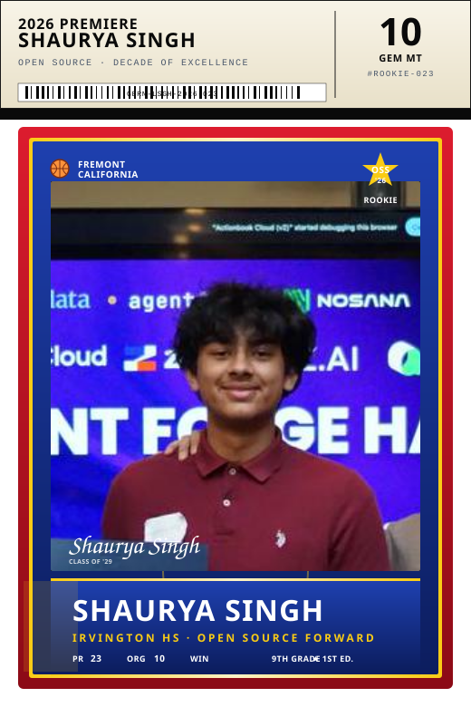

<div align="center">



</div>

<br/>

```
╭──────────────────────────────────────── CARD BACK ─────────────────────────────────────────╮
│                                                                                            │
│   PLAYER       SHAURYA SINGH                                                               │
│   BORN         FREMONT, CA                                                                 │
│   TEAM         IRVINGTON HS · CLASS OF '29                                                 │
│   DRAFTED      MIDDLE SCHOOL · UNDRAFTED · WALK-ON                                         │
│                                                                                            │
├────────────────────────────────────────────────────────────────────────────────────────────┤
│                                                                                            │
│   CAREER HIGHLIGHTS                                                                        │
│   ─ Beta Fund AI Super Hackathon · winner · $500 · built ShadowBuyer                       │
│   ─ ShadowBuyer demo: saved a roleplayed F500 buyer $225k in one run                       │
│   ─ facebook/pyrefly#3415 · landed via Phabricator · flagship merge                        │
│   ─ 23 PRs merged across Meta, Apple, Microsoft, NVIDIA, Cloudflare, Google,               │
│     OpenAI, Astral, and friends                                                            │
│   ─ 50+ PRs currently in review · 10 orgs reached                                          │
│                                                                                            │
├────────────────────────────────────────────────────────────────────────────────────────────┤
│                                                                                            │
│   OFF THE COURT                                                                            │
│   ─ Senior Patrol Leader · Boy Scouts of America · troop of 40-50                          │
│   ─ Freshman team basketball captain · Irvington HS                                        │
│   ─ Lead CAD designer · FTC Robotics · 3× regional finalist                                │
│   ─ 2 Eagle Scout service projects led                                                     │
│   ─ Anthropic Academy · certified · agentic systems track                                  │
│                                                                                            │
├────────────────────────────────────────────────────────────────────────────────────────────┤
│                                                                                            │
│   CURRENTLY SHIPPING                                                                       │
│   ─ edgeboard · real-time collaborative dashboard                                          │
│   ─ shadowbuyer v2 · multi-agent procurement swarm                                         │
│   ─ urbanmind-vision · 50-year city simulation with an RL agent                            │
│   ─ shotsense-scout · MongoDB + Google Cloud Agent Builder NBA scout                       │
│                                                                                            │
├────────────────────────────────────────────────────────────────────────────────────────────┤
│                                                                                            │
│   REACH                                                                                    │
│   ─ github.com/LeSingh1                                                                    │
│   ─ linkedin.com/in/shaurya-singh-b7591540b                                                │
│   ─ sshaurya914 [at] gmail                                                                 │
│                                                                                            │
╰────────────────────────────────────────────────────────────────────────────────────────────╯
```

<sub align="center"><i>collect all five — only one printed.</i></sub>
